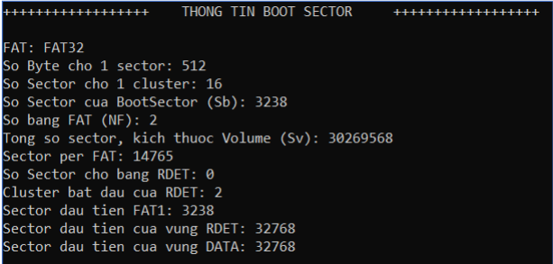
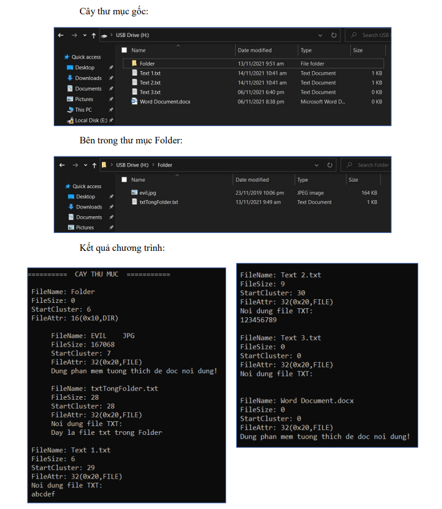
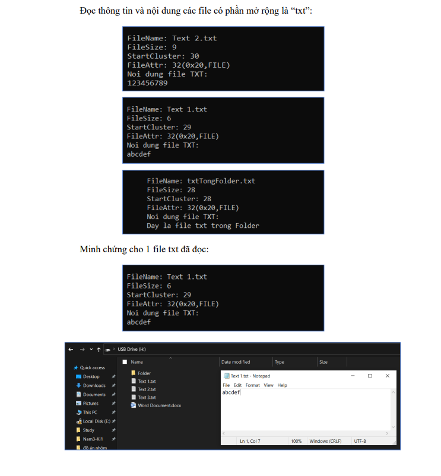
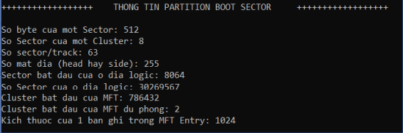
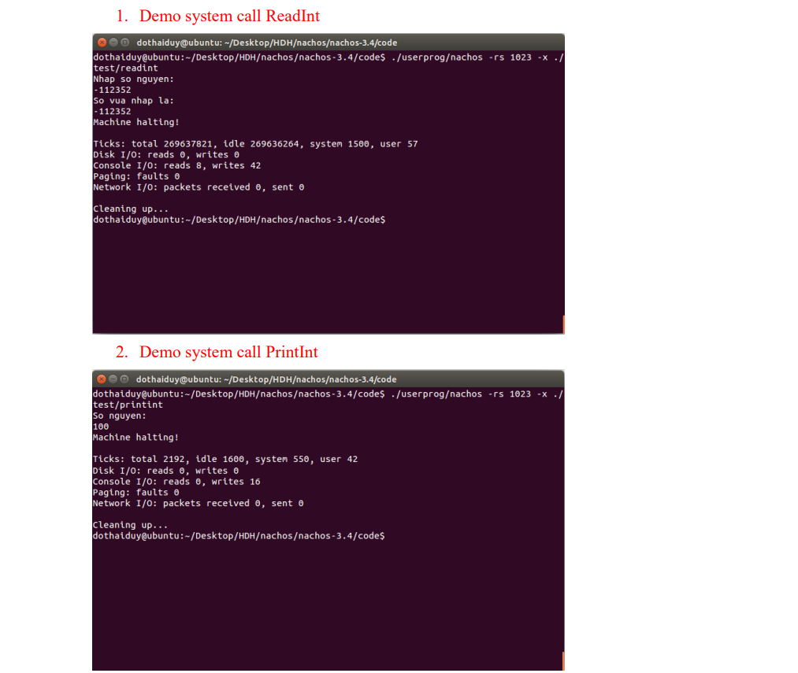
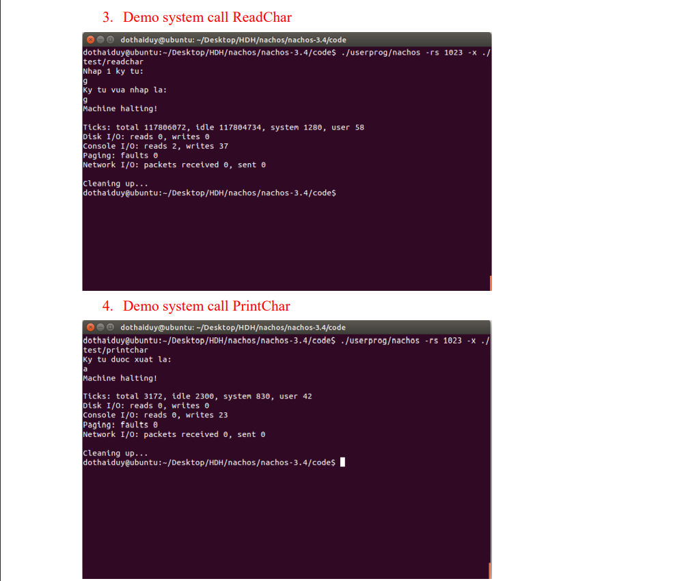
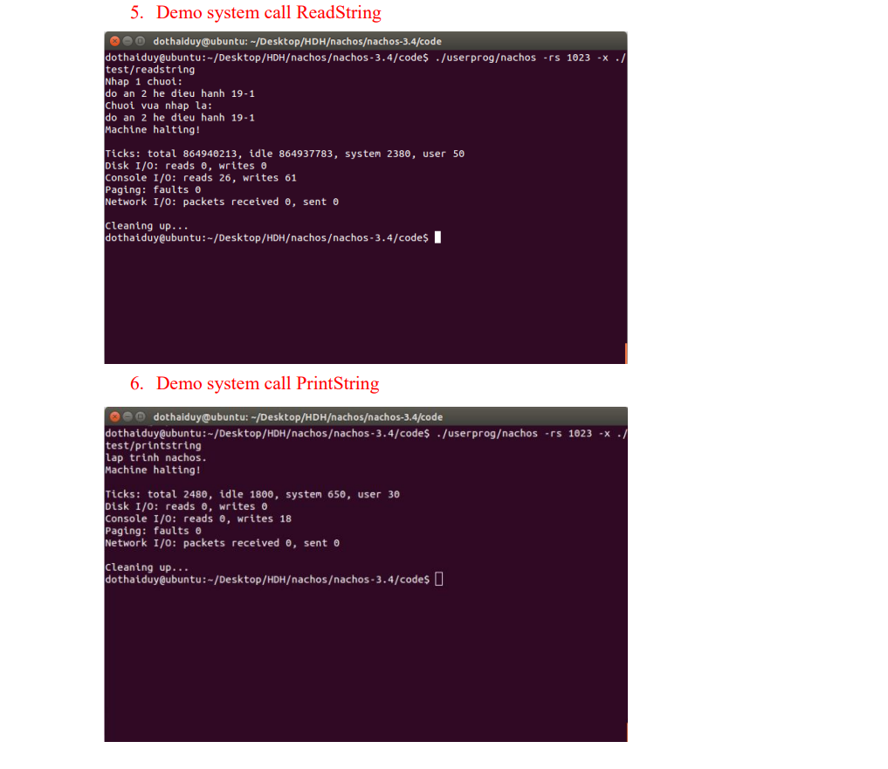
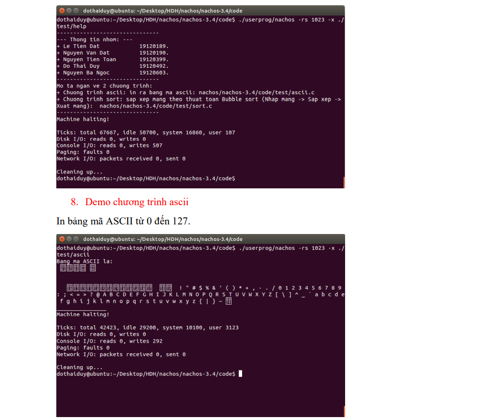
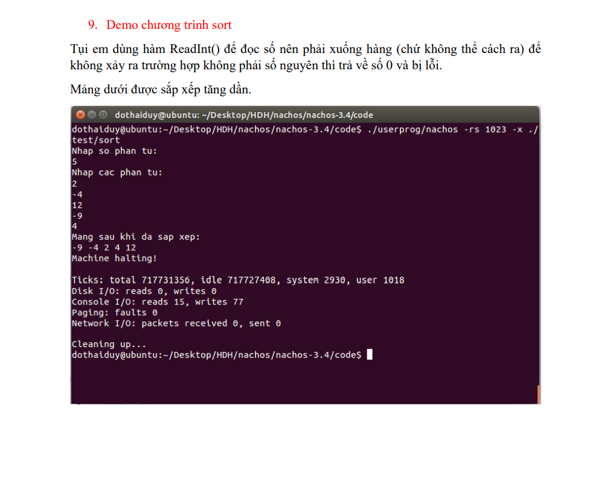
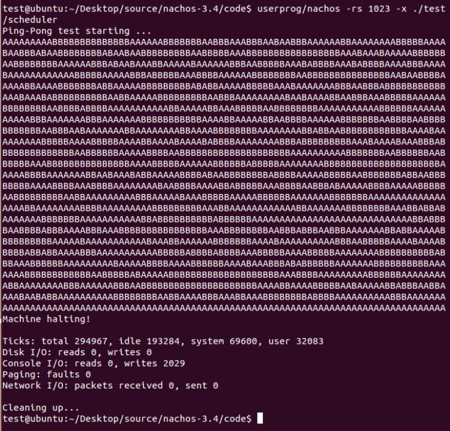

# Hệ điều hành 
Tổng hợp 3 đồ án môn Hệ điều hành lớp 19_1, trường Đại học KHTN - TP.HCM

### Thông tin nhóm

|       Họ và tên      |   MSSV   | Email                           | 
|----------------------|:--------:|---------------------------------|
| Lê Tiến Đạt    | 19120189 | 19120189@student.hcmus.edu.vn            |
| Nguyễn Văn Đạt | 19120190 | 19120190@student.hcmus.edu.vn |
| Nguyễn Tiến Toàn         | 19120399 | 19120399@student.hcmus.edu.vn        |
| Đỗ Thái Duy         | 19120492 | 19120492@student.hcmus.edu.vn        |
| Nguyễn Bá Ngọc         | 19120603 | 19120603@student.hcmus.edu.vn        |

### Tổng hợp 3 đồ án:
**1. Project 1: Hệ thống quản lý tập tin trên Windows (FAT + NTFS).**
>Hình ảnh minh họa

**2. Project 2: System call trên NACHOS.**
>Hình ảnh minh họa

**3. Project 3: Đa chương và đồng bộ hóa trên NACHOS.**
>Hình ảnh minh họa

**Cách chạy chương trình**
1. Project 1
#### *Yêu cầu*:
* Cài đặt Visual Studio.
* 1 USB có các file/ thư mục để test.
* Disk Editor (kiểm tra các thông số).

#### *Cách chạy*:
* Nhấn tổ hợp Ctrl + F5 để chạy chương trình.
* Chọn định dạng File System và ghi tên ổ đĩa cần đọc thông số.

2. Project 2
#### *Yêu cầu*:
* Cài đặt VMWare và hệ điều hành Ubuntu 14 trên máy ảo này.

#### *Cách chạy*:
* Mở terminal của hệ điều hành.
* cd đến thư mục code trong thư mục nachos.
> cd Desktop/nachos/nachos-3.4/code
* Gõ _make_ để biên dịch.
* Gõ _userprog/nachos -rs 1023 -x ./test/_ + _tên chương trình_ cần chạy.
> userprog/nachos -rs 1023 -x ./test/readint

3. Project 3
> Thực hiện các bước tương tự Project 2